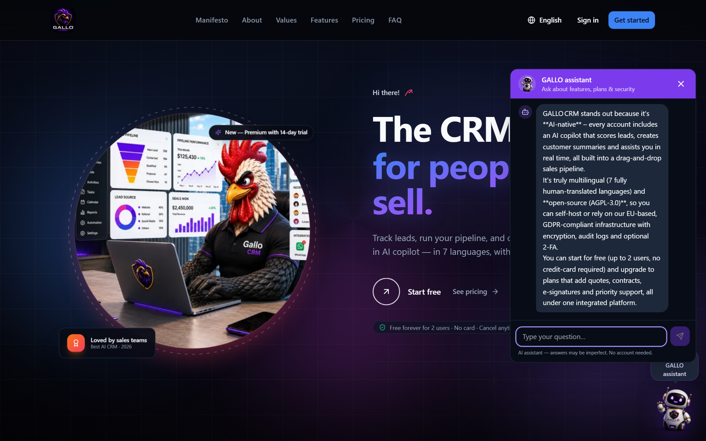
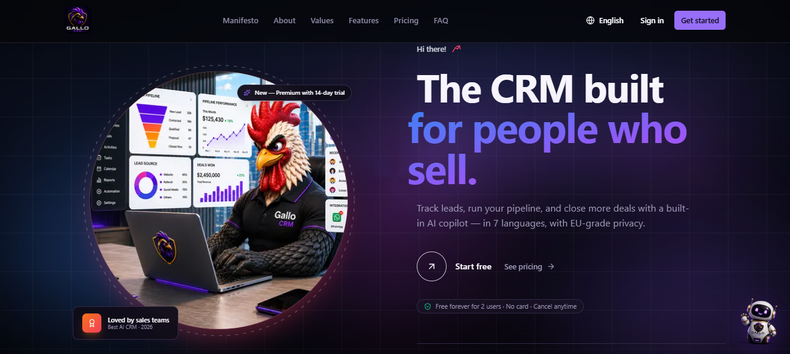
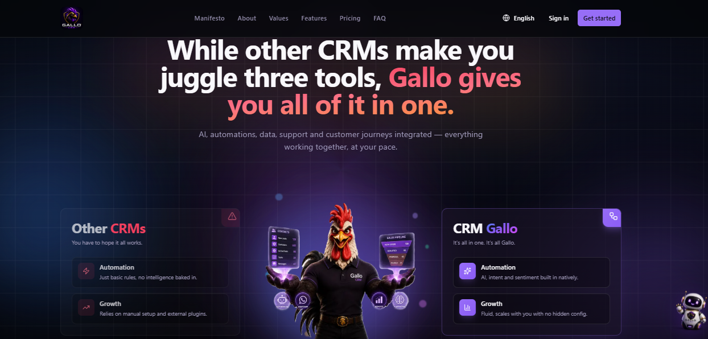
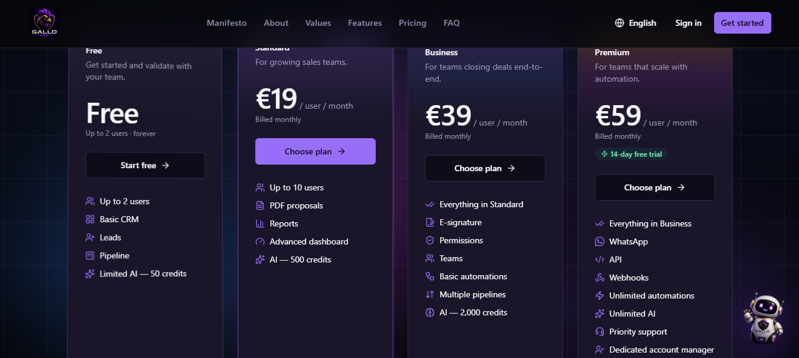
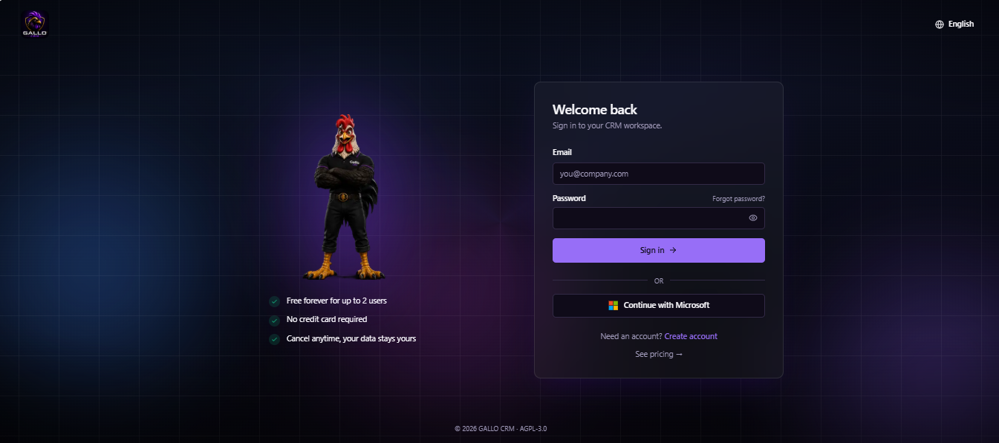
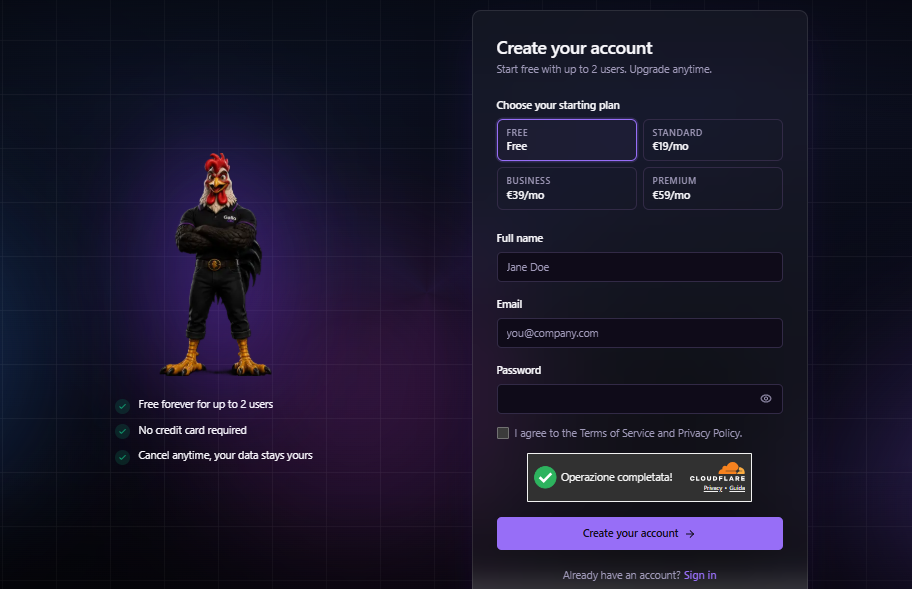
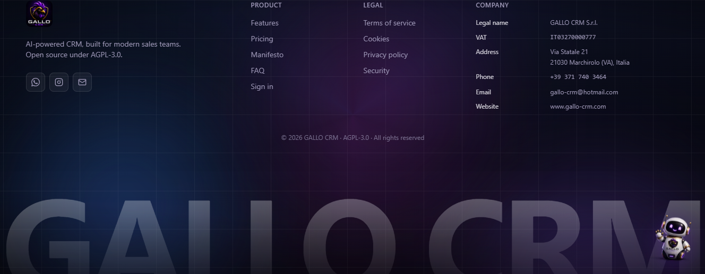

<p align="center">
  
</p>

<h1 align="center">GALLO CRM</h1>

<p align="center">
  <strong>The CRM that makes sure no opportunity is forgotten.</strong><br>
  AI-assisted · multi-tenant · multilingual — track leads, run your pipeline, and close more deals.
</p>

<p align="center">
  
  
  
  
  
  
  
</p>

---

GALLO CRM is a **production-grade, multi-tenant CRM platform** that carries a deal from first touch to signature — **leads → pipeline → deals → quotes → contracts → e-signature** — with AI lead scoring, a sales assistant, omnichannel messaging, multi-currency, Stripe billing, native GDPR tooling, and a 7-language UI. Tenant data is isolated at the database layer with **PostgreSQL Row-Level Security**, and the auth surface ships mandatory MFA, refresh-token rotation, and a full audit trail.

Its product north star is **action over dashboards**: a follow-up engine and a *"Hoje"* (Today) action center answer the only question a salesperson cares about — *"what do I do next to close?"*

🌐 **Live:** [app.gallo-crm.com](https://app.gallo-crm.com) · **API:** [api.gallo-crm.com](https://api.gallo-crm.com)

---

## Table of contents

- [Screenshots](#-screenshots)
- [Features](#-features)
- [Architecture](#️-architecture)
- [Tech stack](#️-tech-stack)
- [Quick start (Docker)](#-quick-start-docker)
- [Local development](#-local-development-without-docker)
- [Configuration](#️-configuration)
- [Testing](#-testing)
- [Deployment](#️-deployment)
- [Public API](#-public-api)
- [Security model](#-security-model)
- [Project structure](#-project-structure)
- [Documentation](#-documentation)
- [License](#-license)

---

## 📸 Screenshots

> A conversion-focused landing and a 7-language product UI — from the pitch to checkout. The hero above shows the built-in **AI assistant**.

|  |  |
| :---: | :---: |
|  |  |
| **Built for people who sell** · the hero pitch, localized in 7 languages | **All-in-one** · one tool instead of juggling three |
|  |  |
| **Pricing** · Free → Premium, monthly or −20% yearly | **Sign in** · email or Microsoft, MFA-ready |
|  |  |
| **Create your account** · free for up to 2 users, no card required | **EU-hosted or self-host** · open-source, AGPL-3.0 |

---

## 🧩 Features

### Sales core
- **Leads, Customers, Companies, Deals** — full CRUD, full-text search (Postgres `tsvector`) with a **pg_trgm typo-tolerant fallback**, cursor pagination, soft-delete with **trash & restore**, owner assignment, and **optimistic locking** (`If-Match`/version) on edits.
- **Follow-up engine** — every active deal can carry a `next_action` (type + date); the kanban surfaces follow-up state (overdue / today / future / done), and the **"Hoje" action center** rolls up overdue & due follow-ups, deals with no next action, stalled deals (>7 days), and today's/overdue tasks.
- **Configurable pipelines** with a **drag-and-drop kanban** (drop on column or card) + a deal detail page (notes, attachments, activity timeline, stage switcher).
- **Tasks** (list + month view) · **activity timeline** · **notes** · in-app **notifications** (header bell).
- **Lead → Customer / Company / Deal conversion** — atomic and dedup-aware, with timeline events.
- **Versioned Quotes & Contracts** — line items, server-side totals, state machines, **PDF generation** (WeasyPrint in the worker), **merge-field templates**, and **e-signature** on both (signed token + HMAC webhook).
- **Products / Services catalog** — priced items the tenant sells, pre-fillable into quote & contract line items.
- **Tags & saved segments**, **custom fields**, and **duplicate detection & merge**.
- **Web-to-Lead forms** — public, tokenized form endpoints that drop submissions straight into the lead inbox.
- **Bulk Imports / Exports** — a 3-phase idempotent CSV/XLSX import worker (dedupe by email→phone) + streaming CSV export.

### AI (locale-aware, single-provider abstraction)
- **Lead scoring** (+ priority, conversion probability, risk analysis, next-best action) and **customer summaries**, with a **heuristic fallback** when no LLM is configured.
- **Sales-assistant chat** (SSE streaming + history) and a **public landing chatbot**, rate-limited per user/IP.
- Provider-abstracted: any **OpenAI-compatible** endpoint (Groq in production), **Ollama** (local), or **Anthropic Claude**. Every call site is **locale-aware** (answers in the user's language) and uses a **per-use-case temperature** (deterministic for scoring, warmer for chat). **Per-org token usage** is tracked with an admin summary.

### Omnichannel & integrations
- **WhatsApp** — Cloud API: accounts, conversations, messages, inbound webhooks, outbound/templated sends, read receipts, team inbox — org-scoped under RLS.
- **Public REST API** (`/api/v1`) authenticated with **bearer API keys** (sha256-at-rest, scoped, per-key rate limited) — see [docs/api/v1.md](docs/api/v1.md).
- **Outgoing webhooks** — HMAC-signed, outbox-backed, with retry, auto-pause, secret rotation, a `/test` ping, and delivery metrics.
- **No-code automations** — trigger → condition → action rules (e.g. `lead.created`, `task.overdue`, `customer.created`).

### Multi-currency, billing & GDPR
- **Multi-currency display layer** — per-deal currency (inheriting the org default), a **per-user display currency** (EUR/CHF/USD/GBP), and a live **FX layer** (daily ECB rates via frankfurter.dev, cached with as-of stamping). Stored amounts stay canonical; conversion is display-only.
- **Stripe billing** — Free / Standard / Business / Premium (monthly + annual −20%), multi-currency price points, Checkout + Customer Portal, signed idempotent webhooks as the source of truth, seats, and a 14-day Premium trial. **Free works with zero Stripe config.**
- **Native GDPR** — per-contact consent capture, **anonymize-in-place "forget" + data export**, and a per-org retention sweep — surfaced in a settings card.

### Multi-tenancy & auth
- **Organizations** isolated by **PostgreSQL Row-Level Security** (transaction-scoped tenant GUC, `ENABLE` + `FORCE`), an org switcher, an **invite flow**, and per-org **seat limits**.
- **JWT in httpOnly cookies + double-submit CSRF**, **refresh-token rotation** with reuse detection & server-side revocation.
- **MFA (TOTP)** — **mandatory for admin/manager** — with Fernet-encrypted secrets and backup codes; plus **email verification**, **password reset**, a sessions page, **Microsoft OAuth**, and **Cloudflare Turnstile** on register.
- **RBAC** + per-resource ownership, and an **RLS-strict audit log** appended on every mutation.

### Insight & onboarding
- **Action-oriented dashboard** — live KPIs, pipeline value (per-currency + FX-converted headline), funnel, monthly revenue, and a quotes summary.
- **Performance & KPI screen** — sales goals, win rates, leaderboards, and a financial report tab.
- **Onboarding** — a computed setup checklist, **7 sector pipeline templates**, and empty-states-with-CTA on every list.

### Platform
- **Transactional email** (Resend / SMTP / console) with autoescaping templates in all 7 locales.
- **Background worker** (Arq): scoring, PDF, email, the **outbox + event bus**, webhook delivery, retention/FX/prune crons, and a **dead-letter queue**.
- **7-language UI** — English, Deutsch, Français, Italiano, Rumantsch, Português, Español — with light/dark mode and CI key-parity.
- **Observability** — structured JSON logs with per-request `X-Request-ID`, `/health` + `/ready` probes, Sentry (EU) + PostHog (EU), Prometheus metrics, and a reusable [post-deploy smoke](scripts/post_deploy_smoke.py).

---

## 🏛️ Architecture

Three deployable services + a worker, all sharing one Postgres and one Redis:

```
              ┌────────────┐         ┌─────────────────┐
  browser ───▶│  frontend  │ ──────▶ │   crm_gallo     │   FastAPI (async)
   (SPA)      │  Next.js 15│  HTTPS  │   API service   │   — RLS per request
              └────────────┘         └────────┬────────┘
                                               │  enqueue (Redis)
                                               ▼
   PostgreSQL 16+  ◀── RLS ──▶            ┌──────────┐
   (tenant data,   ◀───────────────────▶ │  worker  │  Arq jobs + crons
    outbox, audit)                        └──────────┘  scoring · PDF · email
        ▲                                       │        outbox drain · FX · webhooks
        └─────────── Redis 7 ───────────────────┘
                 (cache · rate limits · job queue)
```

**Key patterns**
- **Tenant isolation = shared schema + RLS** (defense-in-depth). Two DB roles: `crm` (owner / Alembic DDL) and `crm_app` (runtime, `NOBYPASSRLS`). Each request/job sets a transaction-scoped `app.current_org_id` GUC; RLS policies filter every tenant table — so a forgotten `WHERE` can't leak across tenants.
- **Transactional outbox + event bus** — domain mutations append an event in the same transaction; the worker drains it (`FOR UPDATE SKIP LOCKED`, backoff, DLQ) and fans out to webhooks/automations. At-least-once delivery without distributed transactions.
- **Alembic owns the schema** — no `create_all`; migrations apply on container start.
- **Money is `Decimal` / minor units, never float**; FX conversion is display-only.

A full set of **Mermaid UML diagrams** (class, ER, component, deployment, sequence & state) lives in **[docs/UML.md](docs/UML.md)**.

---

## 🛠️ Tech stack

| Layer       | Choice                                                                 |
| ----------- | --------------------------------------------------------------------- |
| Frontend    | Next.js 15 · React 19 · TypeScript · Tailwind · shadcn/ui · framer-motion · recharts |
| i18n        | next-intl (7 locales, URL-prefixed)                                   |
| Backend     | FastAPI (async) · SQLAlchemy 2.0 · Pydantic v2 · Alembic · SlowAPI    |
| Worker      | Arq (Redis-backed jobs, cron, outbox drain)                          |
| Database    | PostgreSQL 16+ · Row-Level Security                                  |
| Cache/Queue | Redis 7                                                               |
| Storage     | S3-compatible (MinIO in dev · Cloudflare R2 in prod)                 |
| AI          | OpenAI-compatible (Groq in prod) · Ollama · Anthropic — abstracted   |
| Email       | Resend · SMTP · console (dev)                                        |
| Payments    | Stripe (Checkout, Customer Portal, webhooks)                         |
| FX          | European Central Bank rates via frankfurter.dev (cached daily)       |
| Observability | structlog (JSON) + request-id middleware · Sentry · PostHog · Prometheus |
| CI/CD       | GitHub Actions (lint · type · test · build · Trivy · e2e) → GHCR → Railway |

---

## 🚀 Quick start (Docker)

```bash
cp .env.example .env
# Edit .env — set JWT_SECRET (>= 32 chars). LLM, email, and Stripe keys are optional.
docker compose up --build
```

| Service            | URL                            |
| ------------------ | ------------------------------ |
| Frontend           | http://localhost:3030          |
| Backend API + docs | http://localhost:8001/docs     |
| Liveness / DB ping | http://localhost:8001/health · `/ready` |

The **first account you register becomes the admin** (race-safe via a Postgres advisory lock). The dev stack also brings up Redis, MinIO, and Ollama.

---

## 🧑‍💻 Local development (without Docker)

**Backend**
```bash
cd backend
python -m venv .venv && .venv\Scripts\activate    # PowerShell on Windows
pip install -r requirements.txt
alembic upgrade head
uvicorn app.main:app --reload --port 8001
```

**Frontend**
```bash
cd frontend
npm install
NEXT_PUBLIC_API_URL=http://localhost:8001 npm run dev -- -p 3030
```

> The DB schema is managed by **Alembic** — run `alembic upgrade head` after pulling new migrations.
> ⚠️ Never run `alembic upgrade head` straight after `--autogenerate` without reviewing the file first (autogen can emit phantom `drop_index` for partial/DESC indexes).
> ⚠️ New table migrations must **explicitly `GRANT` to `crm_app`** — the runtime role can't be assumed to inherit access.

**API types** — the frontend's `src/lib/api-types.ts` is generated from the backend OpenAPI schema, which is the single source of truth for request/response shapes. After changing any endpoint or Pydantic schema, regenerate both and commit them (CI fails on drift):
```bash
cd backend && python -m scripts.dump_openapi > openapi.json   # refresh the schema
cd ../frontend && npm run gen:api-types                        # regenerate TS types
```

---

## ⚙️ Configuration

All config lives in `.env` (see `.env.example`). The most relevant keys:

| Variable | Purpose |
| --- | --- |
| `JWT_SECRET` | **Required.** ≥32 random chars; the app refuses to boot in prod with a weak/default secret. |
| `DATABASE_URL` / `APP_DATABASE_URL` | Owner role (Alembic DDL) vs runtime role (`crm_app`, RLS-enforcing). |
| `REDIS_URL` | Sessions, rate limits, Arq queue. |
| `LLM_PROVIDER` | `openai_compat` (prod, e.g. Groq) · `ollama` (default, local) · `anthropic`. |
| `LLM_API_KEY` / `LLM_BASE_URL` / `ANTHROPIC_API_KEY` / `OLLAMA_URL` | LLM credentials per provider (optional — heuristic fallback otherwise). |
| `EMAIL_PROVIDER` | `console` (dev) · `resend` · `smtp`. |
| `RESEND_API_KEY` / `EMAIL_FROM` | Transactional email (when `EMAIL_PROVIDER=resend`). |
| `STRIPE_SECRET_KEY` + `STRIPE_PRICE_*` | Paid plans (Free works without them). |
| `S3_ENDPOINT_URL` / `S3_*` | File attachments (MinIO in dev, R2 in prod). |
| `MFA_REQUIRED_FOR_PRIVILEGED` | When `true`, admin/manager must enroll TOTP before accessing data. |
| `TURNSTILE_SECRET_KEY` | Cloudflare Turnstile on register (fails open if the provider errors). |
| `MICROSOFT_CLIENT_ID` / `MICROSOFT_CLIENT_SECRET` | Microsoft OAuth sign-in (optional). |
| `SENTRY_DSN` / `POSTHOG_API_KEY` | Error tracking & product analytics (EU; optional). |

---

## 🧪 Testing

```bash
# Backend — pytest against the dev Postgres (RLS exercised as crm_app)
docker compose run --rm backend pytest -q

# Frontend — type-check, lint, unit, i18n key-parity
cd frontend && npx tsc --noEmit && npm run lint && npm test

# End-to-end (Playwright golden path)
cd frontend && npm run test:e2e
```

CI runs the same gates on every PR: ruff · pytest · pip-audit · alembic (backend), tsc · eslint · vitest · i18n-parity (frontend), Trivy (images), Playwright smoke (e2e), and gitleaks/trufflehog (secrets).

After a deploy, run the unauthenticated smoke against any environment:
```bash
python scripts/post_deploy_smoke.py --api https://api.gallo-crm.com --app https://app.gallo-crm.com
```

---

## ☁️ Deployment

Production runs on **[Railway](https://railway.app)** as separate services — `frontend`, `crm_gallo` (API), `worker`, **Postgres**, and **Redis** — behind the custom domains `app.gallo-crm.com` (SPA) and `api.gallo-crm.com` (API). Object storage is **Cloudflare R2** (EU); email is **Resend**.

**Pipeline:** push to `main` → **GitHub Actions** gates → Docker images published to **GHCR** → released to Railway.

**Release a service** (Railway does not auto-deploy on push — trigger it):
```bash
railway link -p <project> -e production
railway redeploy -s crm_gallo --from-source -y    # rebuilds + runs `alembic upgrade head` on start
railway redeploy -s worker    --from-source -y
railway redeploy -s frontend  --from-source -y
```

Set production secrets in the Railway dashboard. `NEXT_PUBLIC_API_URL=https://api.gallo-crm.com` is **baked at build time** for the frontend image (declared as an `ARG`+`ENV` in its Dockerfile). The migration runs on the `crm_gallo` service's startup.

> 📧 For deliverability, verify the sending domain in Resend (SPF + DKIM + DMARC + MX) before enabling `EMAIL_PROVIDER=resend` in prod.

---

## 🔌 Public API

A versioned, bearer-authenticated REST surface for integrators (`/api/v1`), delegating to the same business logic as the app (identical audit/ownership/RLS behavior).

```bash
curl https://api.gallo-crm.com/api/v1/leads \
  -H "Authorization: Bearer crmk_<org>_<secret>"
```

Mint a key in **Settings → API keys** (`read` and/or `write` scopes; shown once). Cursor-paginated, versioned (`X-API-Version`), and per-key rate limited. **Full reference: [docs/api/v1.md](docs/api/v1.md).**

---

## 🔐 Security model

| Area | Behavior |
| --- | --- |
| Tenancy | Every domain row carries `organization_id`; **PostgreSQL RLS** (transaction-scoped GUC, `FORCE`) enforces isolation even if the app layer forgets. |
| Sessions | JWT in **httpOnly cookies** + JS-readable **CSRF** token; refresh-token **rotation** with reuse detection & revocation. |
| MFA | TOTP enrollment, **mandatory** for privileged roles; secret encrypted at rest (Fernet) + backup codes. |
| Auth | bcrypt hashing; constant-time response for unknown email vs bad password (no enumeration); email verification; Turnstile on register; Microsoft OAuth. |
| RBAC | List/get open to members; mutate requires owner or admin/manager; hard delete / empty-trash require admin. |
| Rate limit | Redis-backed; tighter limits on login, register, password-reset, imports, and the LLM endpoints; per-API-key limits on `/api/v1`. |
| API keys | Public API authenticated by bearer keys, **sha256-at-rest**, scoped, soft-revocable, per-key rate limited. |
| GDPR | Per-contact consent; anonymize-in-place forget + export; per-org retention sweep. |
| Audit | Every mutation appends an `AuditLog` row (RLS-strict) in the same transaction — best-effort, never aborts the request. |
| Boot | Refuses to start in production with a default/short `JWT_SECRET` or an unrecognized `ENVIRONMENT`. |

---

## 📁 Project structure

```
crm_gallo/
├── docker-compose.yml          # dev stack: db, redis, minio, ollama, backend, worker, frontend
├── README.md · CHANGELOG.md · skills.md   # readme · changelog · internal plan/backlog
├── scripts/post_deploy_smoke.py
├── docs/
│   ├── UML.md                  # full UML (Mermaid: class, ER, sequence, deployment)
│   ├── api/v1.md               # public REST API reference
│   └── screenshots/
├── backend/                    # FastAPI + SQLAlchemy + Alembic + Arq
│   ├── Dockerfile
│   ├── alembic/                # migrations
│   └── app/
│       ├── main.py · config.py · database.py · models.py · schemas.py
│       ├── security.py · deps.py · audit.py · money.py · pagination.py
│       ├── api/                # auth, leads, customers, companies, deals, quotes,
│       │                       #   contracts, tasks, dashboard, assistant, billing,
│       │                       #   fx, llm_usage, webhooks, automations, imports, …
│       ├── billing/  email/  pdf/  imports/  worker/
│       └── services/           # llm, ai_scoring, ai_assistant, fx, llm_usage, chatbot
└── frontend/                   # Next.js 15 App Router
    ├── Dockerfile
    ├── messages/               # en · de · fr · it · rm · pt · es
    └── src/
        ├── middleware.ts       # i18n locale routing
        ├── lib/ · i18n/ · components/ (ui/, marketing/, charts/)
        └── app/[locale]/
            ├── (marketing)     # landing / pricing / login / register / …
            └── (app)/          # authenticated: dashboard, hoje, leads, customers,
                                 #   pipeline, quotes, contracts, tasks, performance,
                                 #   imports, billing, audit, settings, …
```

---

## 📚 Documentation

- **[docs/UML.md](docs/UML.md)** — complete UML: class, enum, ER, component, deployment, use-case, sequence & state diagrams (Mermaid, renders on GitHub).
- **[docs/api/v1.md](docs/api/v1.md)** — public REST API reference (auth, pagination, endpoints, schemas).
- **[CHANGELOG.md](CHANGELOG.md)** — notable changes (Keep a Changelog).
- **[skills.md](skills.md)** — internal engineering backlog, architecture decisions, and project status.

---

## 📝 License

GALLO CRM is licensed under the **GNU Affero General Public License v3.0 or later** (AGPL-3.0-or-later) — see **[LICENSE](LICENSE)** and **[NOTICE](NOTICE)**. Copyright © 2026 Kallebe Gallo.

- Use, modify, and self-host freely.
- If you run a **modified version** as a network service, you must publish your modifications under the same license.
- A commercial dual-license is available — contact the copyright holder.
