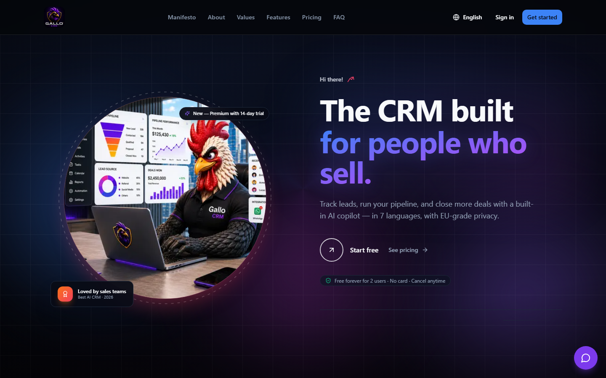
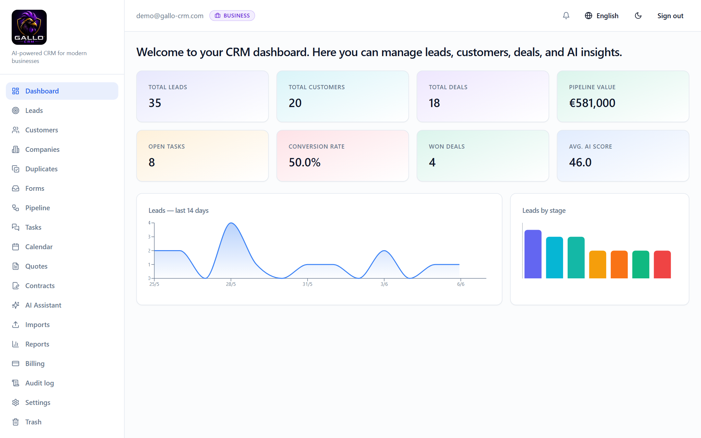
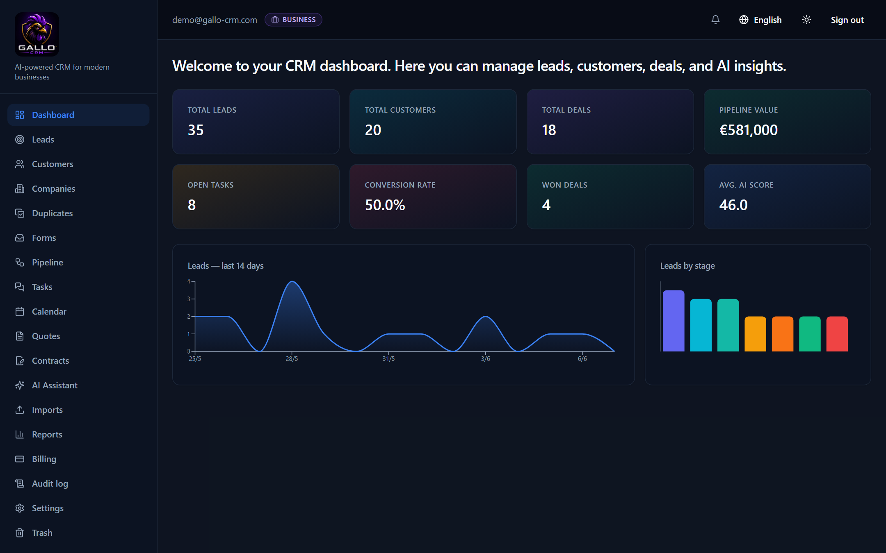
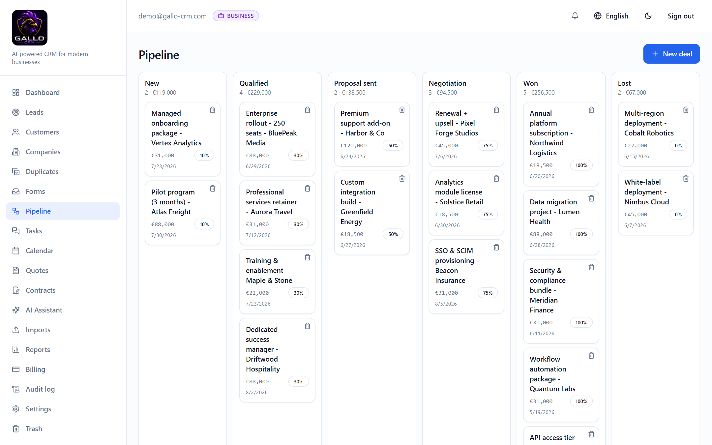
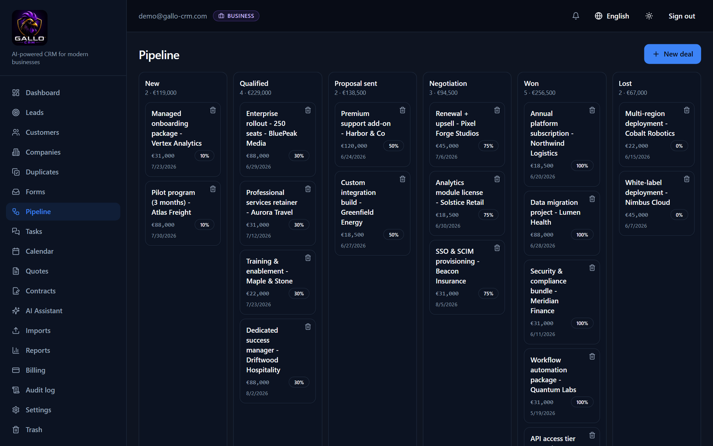
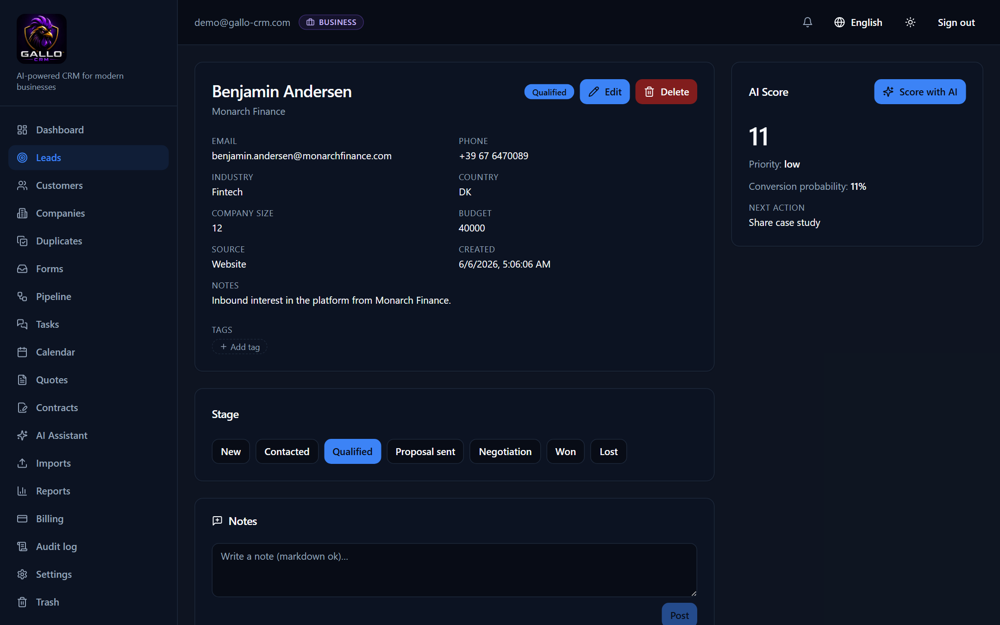

<p align="center">
  
</p>

<h1 align="center">GALLO CRM</h1>

<p align="center">
  <strong>The CRM built for people who sell.</strong><br>
  AI-powered · multi-tenant · multilingual — track leads, run your pipeline, and close more deals.
</p>

<p align="center">
  
  
  
  
  
  
  
</p>

---

GALLO CRM is a **production-grade, multi-tenant CRM platform** that takes a deal from first touch to signature: **leads → pipeline → deals → quotes → contracts → e-signature**, with AI lead scoring, a sales assistant, transactional email, Stripe billing, and a 7-language UI. Tenant data is isolated at the database layer with **PostgreSQL Row-Level Security**, and the auth surface ships MFA, refresh-token rotation, and a full audit trail.

🌐 **Live:** [app.gallo-crm.com](https://app.gallo-crm.com)

---

## 📸 Screenshots

> Full **light & dark** themes · a built-in **AI assistant** · AI lead scoring — across a 7-language UI.

|  |  |
| :---: | :---: |
|  |  |
| **Dashboard — light** · live KPIs, 14-day trend, pipeline value & avg. AI score | **Dashboard — dark** · same view, themed |
|  |  |
| **Pipeline — light** · drag-and-drop kanban across stages | **Pipeline — dark** |
|  |  |
| **AI lead scoring** · priority, conversion probability & next-best action | **AI assistant** · answers product questions in real time |

---

## 🧩 Features

### CRM core
- **Leads, Customers, Companies, Deals, Tasks, Calendar** — CRUD, full-text search (Postgres `tsvector`), soft-delete with trash & restore, cursor pagination.
- **Configurable pipelines** with a **drag-and-drop kanban** (drop on column or card).
- **Versioned Quotes & Contracts** — line items, server-side totals, PDF generation (WeasyPrint), **merge-field templates**, and **e-signature** on both (token + HMAC webhook).
- **Bulk Imports / Exports** — 3-phase idempotent CSV/XLSX import worker + streaming CSV export.
- **Omnichannel inbox** — WhatsApp Cloud API (accounts · conversations · messages) with inbound webhooks and outbound sends, org-scoped under RLS.
- **Product / Service catalog** — priced catalog items the tenant sells, ready to attach to quotes & contracts.

### AI
- **Lead scoring** + next-best-action and **customer summaries** via **Anthropic Claude**, **Ollama** (local), or any OpenAI-compatible provider — with a heuristic fallback when no LLM is configured.
- **Sales-assistant chat** and a **public landing chatbot**, rate-limited per user/IP.

### Multi-tenancy & auth
- **Organizations** isolated by **PostgreSQL Row-Level Security** (transaction-scoped tenant GUC), org switcher, **invite flow**, and per-org **seat limits**.
- **JWT in httpOnly cookies + CSRF**, **refresh-token rotation** with reuse detection & server-side revocation.
- **MFA (TOTP)** — optionally **mandatory for admin/manager** — plus **email verification** on signup and **password reset**.
- **RBAC** + per-resource ownership, and an **audit log** appended on every mutation.

### Billing
- **Free / Standard / Business / Premium** tiers (EUR, monthly + annual), **Stripe** Checkout + Customer Portal, signed idempotent webhooks, and a **14-day Premium trial**. Free works with **zero** Stripe config.

### Platform
- **Transactional email** (Resend / SMTP / console) with autoescaping templates in all 7 locales.
- **Background worker** (Arq): scoring, PDF, email, **outbox + event bus**, and **HMAC-signed outgoing webhooks** with retry & auto-pause.
- **Public REST API** (`/api/v1`) authenticated with **bearer API keys** (sha256-at-rest) and per-key rate limiting.
- **7-language UI** (English, Deutsch, Français, Italiano, Rumantsch, Português, Español) + light/dark mode.
- **Observability** — structured JSON logs with per-request `X-Request-ID`, `/health` + `/ready` probes, Sentry integration.

---

## 🏗️ Tech stack

| Layer       | Choice                                                                 |
| ----------- | --------------------------------------------------------------------- |
| Frontend    | Next.js 15 · React 19 · TypeScript · Tailwind · shadcn/ui · framer-motion · recharts |
| i18n        | next-intl (7 locales, URL-prefixed)                                   |
| Backend     | FastAPI (async) · SQLAlchemy 2.0 · Pydantic v2 · Alembic · SlowAPI    |
| Worker      | Arq (Redis-backed jobs, cron, outbox drain)                          |
| Database    | PostgreSQL 16 + pgvector · Row-Level Security                         |
| Cache/Queue | Redis 7                                                               |
| Storage     | S3-compatible (MinIO in dev · Cloudflare R2 in prod)                 |
| AI          | Anthropic Claude (Sonnet 4.6) · Ollama · OpenAI-compatible           |
| Email       | Resend · SMTP · console (dev)                                        |
| Payments    | Stripe (Checkout, Customer Portal, webhooks)                         |
| Logging     | structlog (JSON) + request-id middleware · Sentry                    |
| CI/CD       | GitHub Actions (lint · type · test · build · Trivy) → GHCR → Railway |

---

## 🚀 Quick start (Docker)

```bash
cp .env.example .env
# Edit .env — set JWT_SECRET (>= 32 chars). LLM, email, and Stripe keys are optional.
docker compose up --build
```

| Service            | URL                            |
| ------------------ | ------------------------------ |
| Frontend           | http://localhost:3030          |
| Backend API + docs | http://localhost:8001/docs     |
| Liveness / DB ping | http://localhost:8001/health · `/ready` |

The **first account you register becomes the admin** (race-safe via a Postgres advisory lock).

---

## 🧑‍💻 Local development (without Docker)

**Backend**
```bash
cd backend
python -m venv .venv && .venv\Scripts\activate    # PowerShell on Windows
pip install -r requirements.txt
alembic upgrade head
uvicorn app.main:app --reload --port 8001
```

**Frontend**
```bash
cd frontend
npm install
NEXT_PUBLIC_API_URL=http://localhost:8001 npm run dev -- -p 3030
```

> The DB schema is managed by **Alembic** — run `alembic upgrade head` after pulling new migrations.
> ⚠️ Never run `alembic upgrade head` straight after `--autogenerate` without reviewing the file first (autogen can emit phantom `drop_index` for partial/DESC indexes).

---

## ⚙️ Configuration

All config lives in `.env` (see `.env.example`). The most relevant keys:

| Variable | Purpose |
| --- | --- |
| `JWT_SECRET` | **Required.** ≥32 random chars; the app refuses to boot in prod with a weak secret. |
| `DATABASE_URL` / `APP_DATABASE_URL` | Owner role (Alembic DDL) vs runtime role (`crm_app`, RLS-enforcing). |
| `REDIS_URL` | Sessions, rate limits, Arq queue. |
| `LLM_PROVIDER` | `ollama` (default, local) · `anthropic` · OpenAI-compatible. |
| `ANTHROPIC_API_KEY` / `OLLAMA_URL` | LLM credentials (optional — heuristic fallback otherwise). |
| `EMAIL_PROVIDER` | `console` (dev) · `resend` · `smtp`. |
| `RESEND_API_KEY` / `EMAIL_FROM` | Transactional email (when `EMAIL_PROVIDER=resend`). |
| `STRIPE_SECRET_KEY` + `STRIPE_PRICE_*` | Paid plans (Free works without them). |
| `S3_ENDPOINT_URL` / `S3_*` | File attachments (MinIO in dev, R2 in prod). |
| `MFA_REQUIRED_FOR_PRIVILEGED` | When `true`, admin/manager must enroll TOTP before accessing data. |

---

## ☁️ Deployment

Production runs on **[Railway](https://railway.app)** as separate services — `frontend`, `crm_gallo` (API), `worker`, **Postgres**, and **Redis** — behind the custom domains `app.gallo-crm.com` (SPA) and `api.gallo-crm.com` (API).

**Pipeline:** push to `main` → **GitHub Actions** gates (ESLint · `tsc` · Vitest · `next build` · pytest · Trivy) → Docker images published to **GHCR** (`ghcr.io/<owner>/crm_gallo/{frontend,backend}:edge`).

**Release a service** (Railway does not auto-deploy on push — trigger it):
```bash
railway link -p <project> -e production
railway redeploy -s frontend --from-source -y     # rebuild from the latest main commit
```

Set production secrets (`JWT_SECRET`, DB/Redis URLs, `RESEND_API_KEY`, `STRIPE_*`, `NEXT_PUBLIC_API_URL=https://api.gallo-crm.com`, …) in the Railway dashboard. `NEXT_PUBLIC_API_URL` is **baked at build time** for the frontend image.

> 📧 For deliverability, verify the sending domain in Resend (SPF + DKIM + DMARC + MX) before enabling `EMAIL_PROVIDER=resend` in prod.

---

## 🔐 Security model

| Area | Behavior |
| --- | --- |
| Tenancy | Every domain row carries `organization_id`; **PostgreSQL RLS** (transaction-scoped GUC) enforces isolation even if the app layer forgets. |
| Sessions | JWT in **httpOnly cookies** + JS-readable **CSRF** token; refresh-token **rotation** with reuse detection & revocation. |
| MFA | TOTP enrollment; optionally **mandatory** for privileged roles; secret stored encrypted at rest. |
| Auth | bcrypt hashing; constant-time response for unknown email vs bad password (no enumeration); email verification on signup. |
| RBAC | List/get open to members; mutate requires owner or admin/manager; hard delete / empty-trash require admin. |
| Rate limit | Redis-backed; tighter limits on login, register, password-reset, and the LLM endpoints. |
| API keys | Public API authenticated by bearer keys, **sha256-at-rest**, soft-revocable, per-key rate limited. |
| Audit | Every mutation appends an `AuditLog` row in the same transaction (best-effort — never aborts the request). |
| Boot | Refuses to start in production with a default/short `JWT_SECRET`. |

---

## 📁 Project structure

```
crm_gallo/
├── docker-compose.yml          # dev stack: db, redis, minio, ollama, backend, worker, frontend
├── README.md
├── skills.md                   # engineering backlog & project status
├── docs/
│   ├── UML.md                  # full UML (Mermaid: class, ER, sequence, deployment)
│   └── screenshots/
├── backend/                    # FastAPI + SQLAlchemy + Alembic + Arq
│   ├── Dockerfile
│   ├── alembic/                # migrations
│   └── app/
│       ├── main.py · config.py · database.py · models.py · schemas.py
│       ├── security.py · deps.py · audit.py · pipelines.py · money.py
│       ├── api/                # auth, leads, customers, companies, deals, quotes,
│       │                       #   contracts, tasks, dashboard, assistant, billing,
│       │                       #   imports, api keys, trash, signing, …
│       ├── billing/  email/  pdf/  imports/  signing/  worker/
│       └── services/           # llm, ai_scoring, ai_assistant
└── frontend/                   # Next.js 15 App Router
    ├── Dockerfile
    ├── messages/               # en · de · fr · it · rm · pt · es
    └── src/
        ├── middleware.ts       # i18n locale routing
        ├── lib/ · i18n/ · components/ (ui/, marketing/, charts/)
        └── app/[locale]/
            ├── (marketing)     # landing / pricing / login / register / …
            └── (app)/          # authenticated: dashboard, leads, customers,
                                 #   pipeline, quotes, contracts, tasks, calendar,
                                 #   reports, imports, billing, audit, settings, …
```

---

## 📚 Documentation

- **[docs/UML.md](docs/UML.md)** — complete UML: class, enum, ER, component, deployment, use-case, sequence & state diagrams (Mermaid, renders on GitHub).
- **[skills.md](skills.md)** — engineering backlog, architecture decisions, and project status.

---

## 📝 License

GALLO CRM is licensed under the **GNU Affero General Public License v3.0 or later** (AGPL-3.0-or-later) — see **[LICENSE](LICENSE)** and **[NOTICE](NOTICE)**. Copyright © 2026 Kallebe Gallo.

- Use, modify, and self-host freely.
- If you run a **modified version** as a network service, you must publish your modifications under the same license.
- A commercial dual-license is available — contact the copyright holder.
