# CRM Gallo — UML (complete)

> **Source of truth:** generated from `backend/app/models.py`, `docker-compose.yml`,
> the API routers and the worker, on 2026-06-01. Keep it in sync when the schema changes.
>
> **How to view:** these are [Mermaid](https://mermaid.js.org) diagrams — they render
> natively on GitHub and in VS Code (install the *Markdown Preview Mermaid Support*
> extension, then open the preview). To export a PNG/SVG (like the ones in `../../uml_crm/`):
> `npx -y @mermaid-js/mermaid-cli -i docs/UML.md -o docs/uml.png`.

## Contents
1. [Domain class diagram — Identity, Tenancy & Auth](#1-class--identity-tenancy--auth)
2. [Domain class diagram — CRM Core](#2-class--crm-core)
3. [Domain class diagram — Collaboration & Timeline](#3-class--collaboration--timeline)
4. [Domain class diagram — Eventing, Integration & Audit](#4-class--eventing-integration--audit)
5. [Enumerations](#5-enumerations)
6. [Entity-Relationship map (all tables)](#6-entity-relationship-map-all-tables)
7. [Component / architecture diagram](#7-component--architecture-diagram)
8. [Deployment diagram (docker-compose)](#8-deployment-diagram-docker-compose)
9. [Use-case diagram (actors & roles)](#9-use-case-diagram-actors--roles)
10. [Sequence — Authentication + refresh rotation](#10-sequence--authentication--refresh-rotation)
11. [Sequence — Async AI lead scoring](#11-sequence--async-ai-lead-scoring)
12. [Sequence — Outbox → outgoing webhook](#12-sequence--outbox--outgoing-webhook)
13. [Sequence — Stripe billing](#13-sequence--stripe-billing)
14. [State — Deal pipeline & Webhook endpoint](#14-state--deal-pipeline--webhook-endpoint)

---

## 1. Class — Identity, Tenancy & Auth

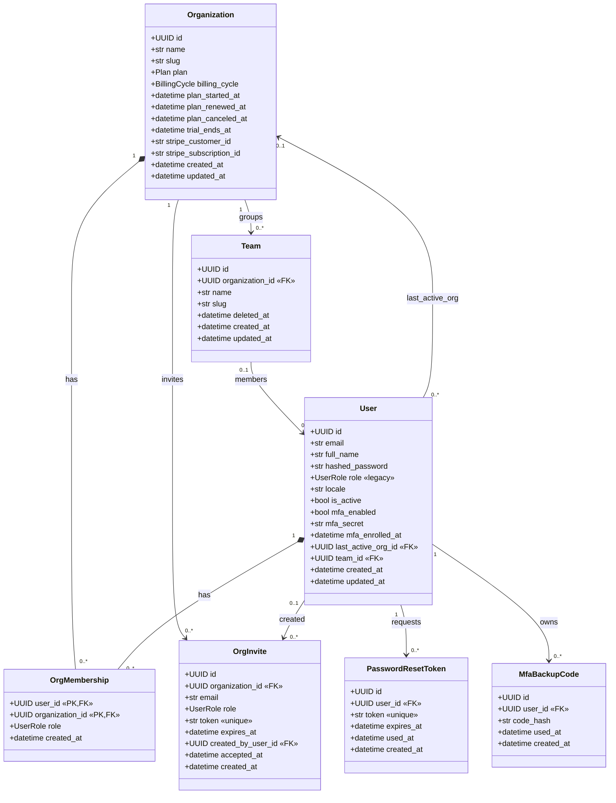

> `OrgMembership` is the M:N junction (composite PK `user_id + organization_id`) — the same
> person can be `admin` in one org and `sales_agent` in another. `User.role` is the legacy
> single-tenant column kept until every call-site reads `OrgMembership.role` (ADR-013).

---

## 2. Class — CRM Core

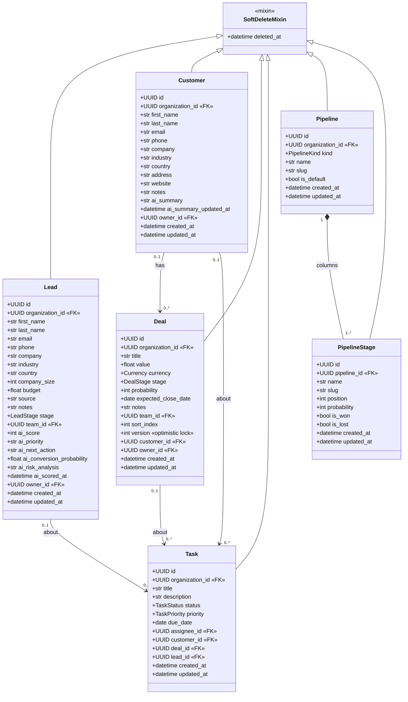

> All six are tenant-scoped via `organization_id` and soft-deletable (trash bin).
> `Pipeline`/`PipelineStage` are the customer-defined funnels that will eventually replace
> the hardcoded `LeadStage`/`DealStage` enums (kept as a denormalised cache during migration).

---

## 3. Class — Collaboration & Timeline

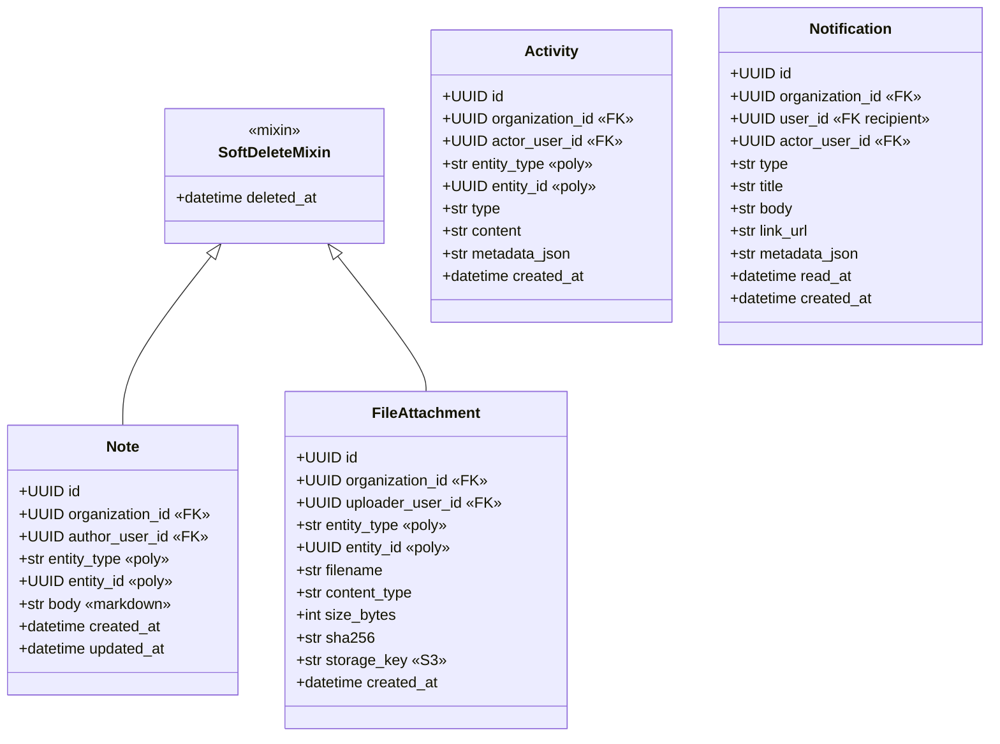

> `Note`, `Activity` and `FileAttachment` are **polymorphic** by `(entity_type, entity_id)` —
> they attach to a `Lead`, `Customer` or `Deal` (and any future `Quote`/`Contract`) with **no
> DB-level FK**, so adding a new host entity needs no migration. `Activity` is append-only
> (user-facing timeline); `Notification` is a per-user inbox (not soft-deletable).

---

## 4. Class — Eventing, Integration & Audit

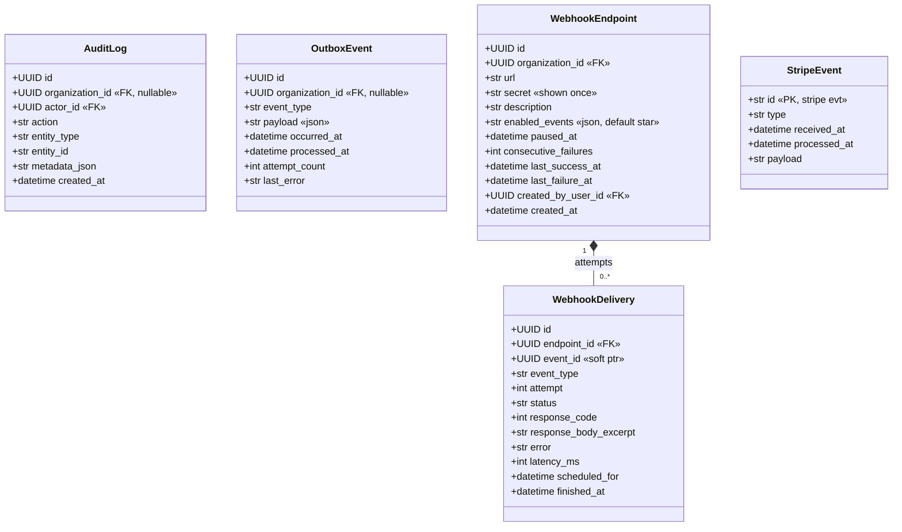

> `OutboxEvent`, `WebhookEndpoint/Delivery` are **not** RLS'd — the worker drains across all
> tenants in one pass; admin reads filter by `organization_id` explicitly. `StripeEvent` is the
> idempotency log so a re-delivered Stripe webhook never double-applies (ADR-011).

---

## 5. Enumerations

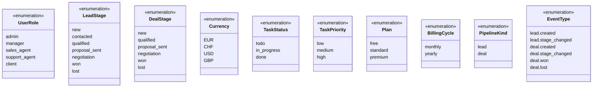

> `Activity.type` and `Notification.type` are string slugs whose vocabularies live in the API
> layer (`app.activities.ActivityType`, `app.notifications.NotificationType`) so adding a new
> kind needs no migration. `EventType` is the outbox vocabulary (`app.events`).

---

## 6. Entity-Relationship map (all tables)

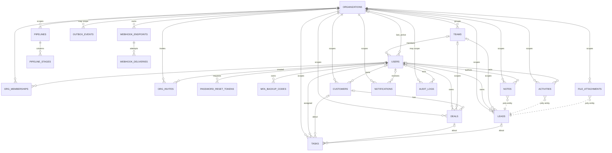

> Cardinality legend: `||` = exactly one, `|o` = zero-or-one (nullable FK / `SET NULL`),
> `o{` = zero-or-many. Polymorphic links (`}o..||`) are shown against `LEADS` for illustration —
> the same `(entity_type, entity_id)` pair also targets `CUSTOMERS` and `DEALS` with no real FK.

---

## 7. Component / architecture diagram

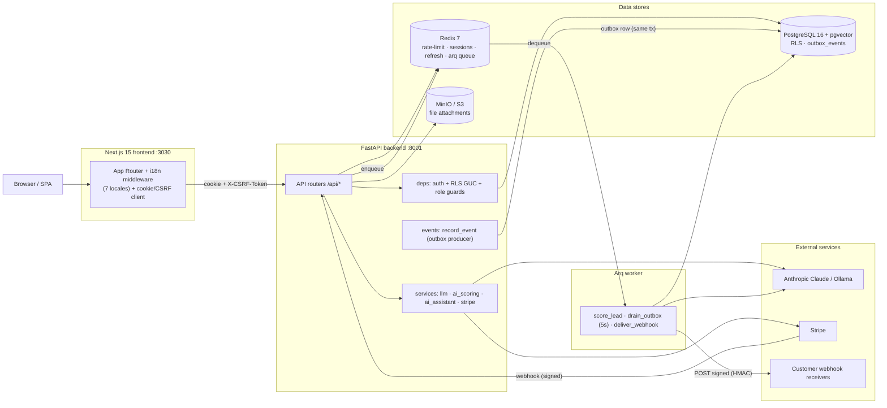

---

## 8. Deployment diagram (docker-compose)

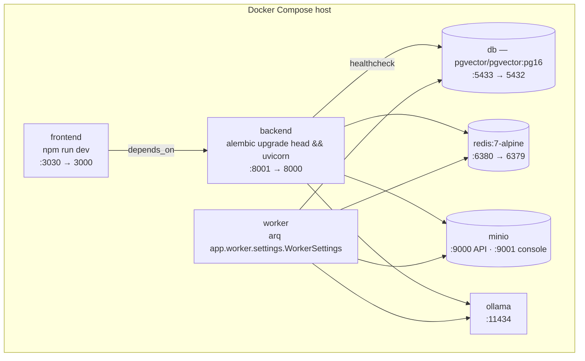

> Single-replica note: the backend runs `alembic upgrade head` on every start. For multi-replica
> deploys, move migrations into a one-shot release job so replicas don't race (ADR-012).

---

## 9. Use-case diagram (actors & roles)

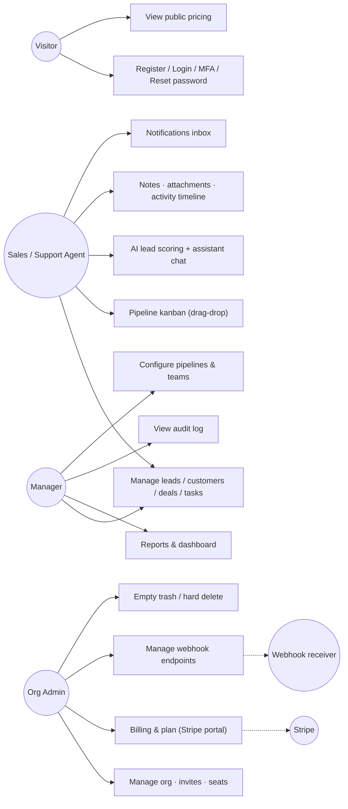

> Roles are hierarchical in practice: `manager` ⊇ `sales_agent` abilities, `admin` ⊇ `manager`.
> Destructive ops (hard delete, empty trash) and webhook/billing management are admin/manager-gated.

---

## 10. Sequence — Authentication + refresh rotation

```mermaid
sequenceDiagram
    actor U as User
    participant FE as Frontend
    participant API as FastAPI
    participant R as Redis
    participant DB as Postgres

    U->>FE: email + password (+ TOTP if MFA on)
    FE->>API: POST /api/auth/login
    API->>DB: verify_password (constant-time, even on unknown email)
    API->>R: create session + store refresh token
    API-->>FE: Set-Cookie access(15m) + refresh(30d) + csrf
    Note over FE,API: subsequent calls send cookie + X-CSRF-Token

    FE->>API: GET /api/leads
    API->>DB: SET app.current_org_id (RLS GUC); SELECT scoped
    API-->>FE: 200 leads (own org only)

    Note over FE: access token expires
    FE->>API: POST /api/auth/refresh (refresh cookie)
    API->>R: validate + ROTATE refresh token
    alt reused (already-rotated) token
        API->>R: revoke ALL user sessions (steal signal)
        API-->>FE: 401 reuse_detected
    else valid
        API-->>FE: Set-Cookie new access + rotated refresh
    end
```

---

## 11. Sequence — Async AI lead scoring

```mermaid
sequenceDiagram
    actor U as User
    participant API as FastAPI
    participant R as Redis (arq queue)
    participant W as Worker
    participant LLM as Claude / Ollama
    participant DB as Postgres

    U->>API: POST /api/leads/{id}/score-async
    API->>R: enqueue score_lead(lead_id, org_id)
    API-->>U: 202 Accepted (job id)
    R->>W: dispatch score_lead
    W->>DB: SET app.current_org_id; load lead
    W->>LLM: score lead (heuristic fallback if down)
    W->>DB: UPDATE ai_* + Activity(ai_scored) + AuditLog; commit
    W-->>R: JobResult (status, score)
    U->>API: poll job status
    API->>R: read JobResult
    API-->>U: scored (score, priority, next action)
```

---

## 12. Sequence — Outbox → outgoing webhook

```mermaid
sequenceDiagram
    participant API as FastAPI
    participant DB as Postgres
    participant W as Worker (cron 5s)
    participant R as Redis (arq)
    participant EP as Webhook receiver

    API->>DB: domain mutation + INSERT outbox_events (same tx)
    loop every 5 seconds
        W->>DB: claim rows FOR UPDATE SKIP LOCKED (backoff 2^attempt)
        W->>W: dispatch_event → in-process subscribers + fanout
        W->>R: enqueue deliver_webhook per matching endpoint
        W->>DB: mark processed_at (or attempt_count++, last_error)
    end
    R->>W: dispatch deliver_webhook
    W->>EP: POST body + X-CRM-Signature (HMAC-SHA256)
    alt 2xx
        W->>DB: WebhookDelivery status=success; consecutive_failures=0
    else non-2xx / timeout
        W->>DB: WebhookDelivery status=failed; consecutive_failures++
        W->>R: arq Retry(defer=2^attempt) up to 8 tries
        Note over W,DB: consecutive_failures ≥ 10 → auto-pause endpoint
    end
```

---

## 13. Sequence — Stripe billing

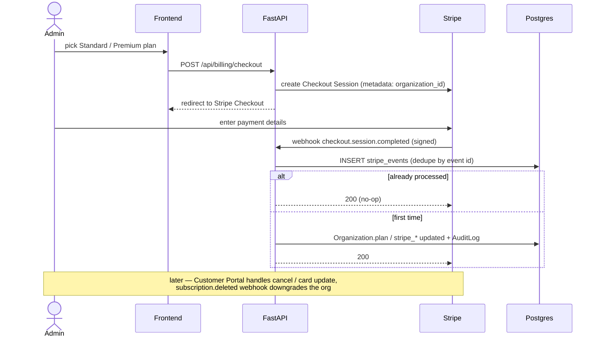

---

## 14. State — Deal pipeline & Webhook endpoint

**Deal stage lifecycle** (`DealStage`; a deal can be marked `lost` from any open stage):

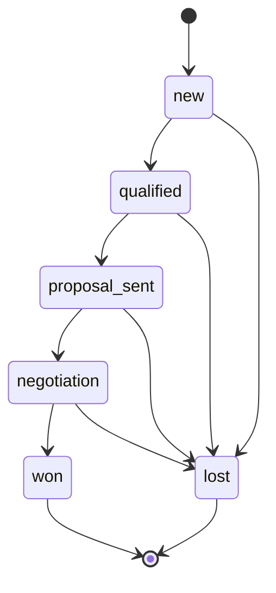

**Webhook endpoint health** (auto-pause after repeated failures):

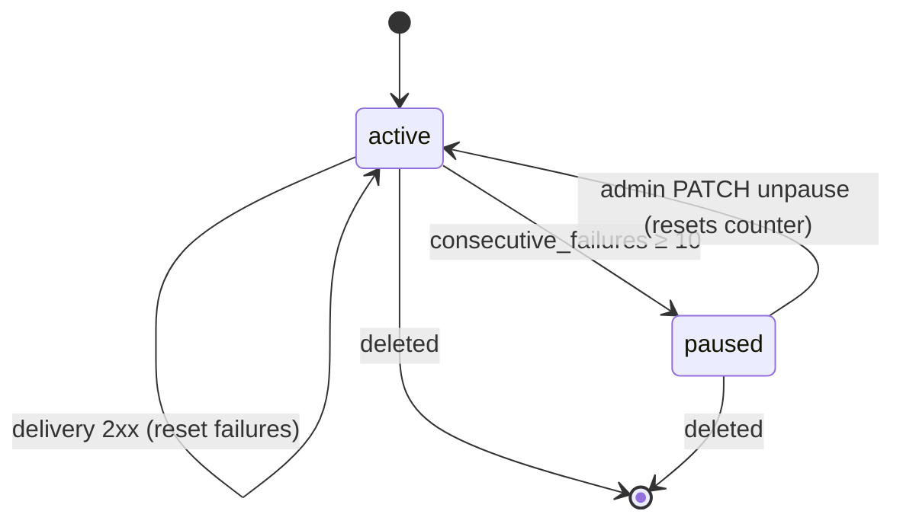

---

*Generated by reverse-engineering the live code. If you change `models.py`, the API surface,
the worker, or `docker-compose.yml`, update the affected diagram here in the same PR.*
